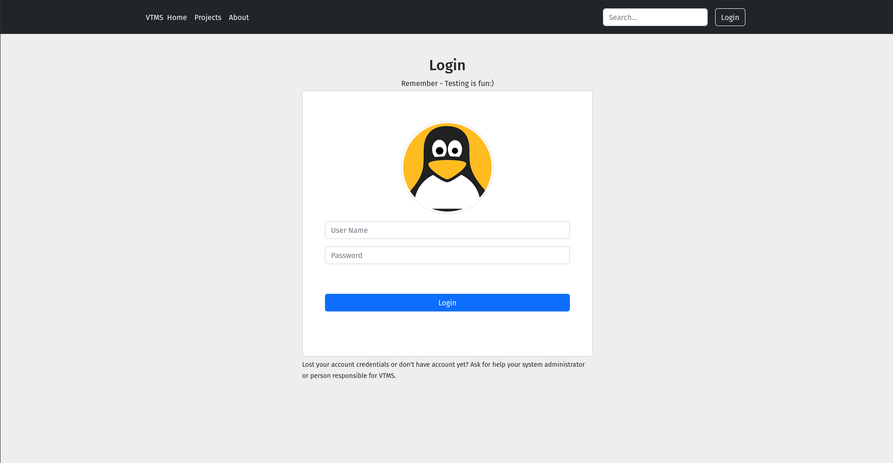
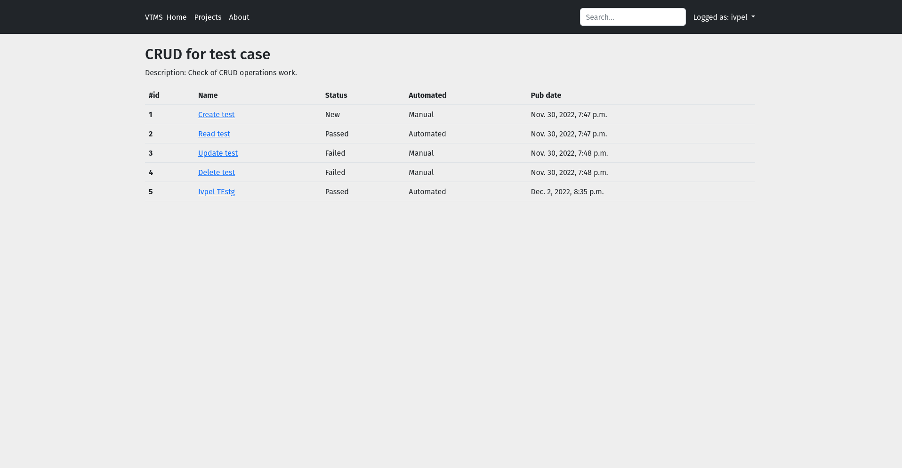
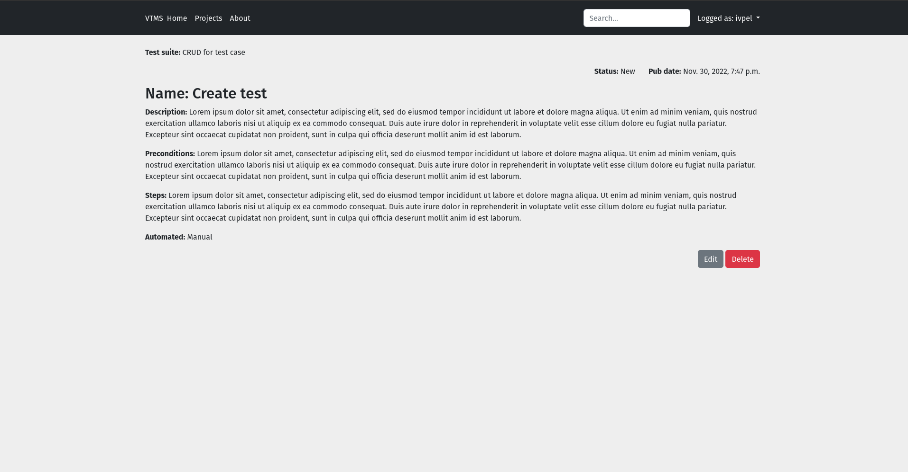

##VTMS
This **Test Management System** is my pet project which was development mostly for **educational** purpose. Even it is fully
functional - it was not planned for production use.
It allows you to create projects, suites and cases to manage your tests.

Also available user module with rights and access functional which Django provide.

### Login page

### Suite page

### Case page
